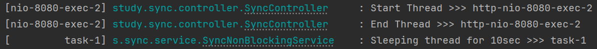

# Sync / Async & Blocking / Non-Blocking with Spring

## Synchronous / Asynchronous (동기 / 비동기)

- 위 사진과 같이 Synchronous(동기) 는 순차적으로 작업이 진행되어, 작업의 순서가 보장되는 것을 볼 수 있다.
- Asynchronous(비동기) 는 여러 작업을 동시에 처리할 수 있는 방식으로, 한 작업이 시작되면 해당 작업이 끝날 때까지 기다리지 않아도 다음 태스크를 바로 진행할 수 있다. 따라서 작업의 순서를 보장할 수 없다.

## Blocking / Non-Blocking

- 블로킹은 자신의 작업을 수행하다가, 다른 작업을 호출했을 때 호출된 작업이 종료될 때까지 아무런 작업을 수행하지 못하고 대기하는 것을 의미한다. (위 그림을 보면 Application 이 Kernel 작업 실행한 후부터 Kernel 작업이 끝날 때까지 아무런 작업을 하지 못하는 것을 볼 수 있다.)
- 논블로킹은 자신의 작업을 수행하다 다른 작업을 호출했더라도 이 작업이 끝날 때까지 기다리지 않고 자신의 작업을 계속 수행할 수 있다.

## 간단한 코드 테스트

- 같은 스레드가 순차적으로 작업을 처리하는 것을 볼 수 있다.

- 다른 스레드가 순차적이지 않게, 작업을 처리하는 것을 볼 수 있다.